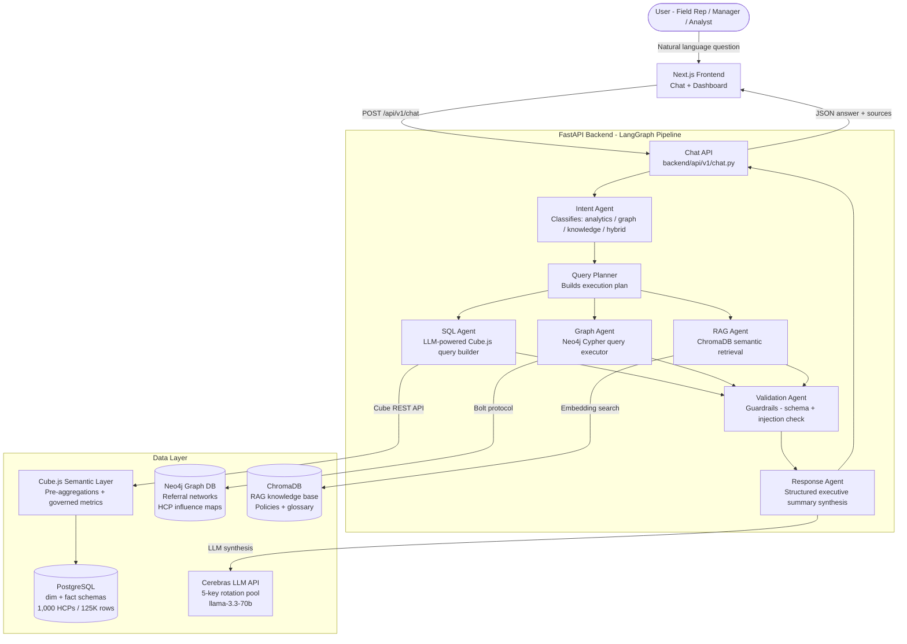
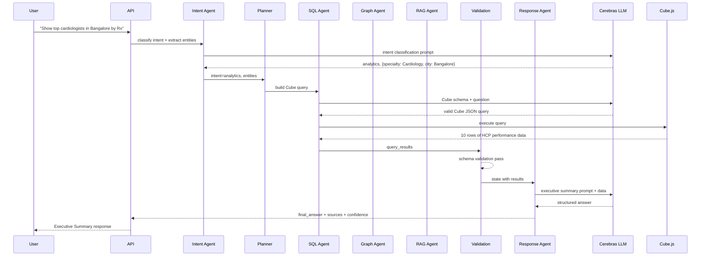
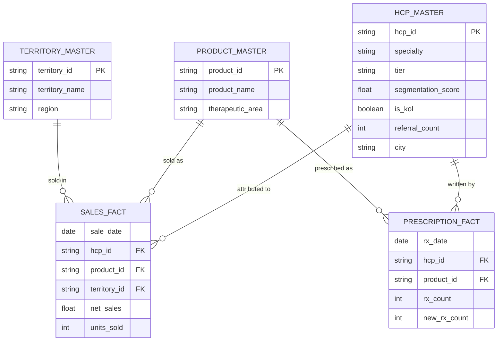

# PulseIQ — Healthcare GenAI Analytics Copilot

PulseIQ is a production-grade, enterprise analytics copilot for pharmaceutical and healthcare commercial teams. It connects governed sales data, prescriber networks, and compliance knowledge into a single natural-language interface powered by a multi-agent LangGraph pipeline.

---

## Architecture Overview



---

## System Components

| Component | Technology | Purpose |
|---|---|---|
| Frontend | Next.js 14, Recharts, Framer Motion | Chat interface, live dashboard, role-based views |
| API Layer | FastAPI, LangGraph | Multi-agent orchestration pipeline |
| Semantic Layer | Cube.js | Governed metrics, pre-aggregations, REST API |
| Analytical DB | PostgreSQL | Star schema: HCPs, sales, prescriptions, territories |
| Graph DB | Neo4j | HCP referral networks, influence mapping |
| Vector DB | ChromaDB | RAG knowledge retrieval: policies, glossary, FAQ |
| LLM | Cerebras API | Intent classification, query generation, response synthesis |

---

## Agent Pipeline



---

## Data Model



---

## RAG Knowledge Base

Documents ingested into ChromaDB at startup:

| Collection | Document | Coverage |
|---|---|---|
| glossary | business_glossary.md | KPIs, tier definitions, metric formulas |
| glossary | faq.md | General platform Q&A |
| glossary | analytics_definitions.md | All Cube measures and dimensions explained |
| glossary | common_business_questions.md | 30+ canonical Q&A pairs with real data |
| compliance | pharma_compliance_policy.md | Off-label, SOPs, promotional rules |
| compliance | hcp_tier_rules.md | Gold/Silver/Bronze classification criteria |
| segmentation | call_planning_sop.md | Visit frequency, priority logic |

---

## Setup

### Prerequisites

- Docker Desktop
- Python 3.12
- Node.js 20
- PostgreSQL (via Docker)
- Neo4j (via Docker)

### 1. Environment

```bash
cp .env.example .env
# Edit .env and add your CEREBRAS_API_KEYS (comma-separated pool)
```

### 2. Start infrastructure

```bash
docker compose -f infrastructure/docker/docker-compose.yml up -d
```

### 3. Load data

```bash
cd data/seed
python generate_synthetic_data.py
python load_to_postgres.py

cd ../neo4j
python load_graph.py
```

### 4. Ingest RAG knowledge

```bash
python -c "
import sys; sys.path.insert(0, '.')
from backend.rag.chroma_client import chroma_rag
chroma_rag.ingest_all(force=True)
"
```

### 5. Start Cube.js

```bash
cd cube
npm install
npm run dev
```

### 6. Start backend

```bash
pip install -r backend/requirements.txt
uvicorn backend.main:app --reload --port 8000
```

### 7. Start frontend

```bash
cd frontend
npm install
npm run dev
```

Open http://localhost:3000

---

## Project Structure

```
rags/
  backend/
    agents/          LangGraph agent nodes (intent, sql, graph, rag, response, validation)
    api/             FastAPI routers
    prompts/         LLM system prompts
    rag/             ChromaDB client and chunker
    semantic/        Cube.js client and metric registry
    utils/           LLM key rotation client, config
  cube/
    model/           Cube.js schema files (SalesFact, HcpMaster, etc.)
  data/
    rag/glossary/    Knowledge base markdown documents
    seed/            Synthetic data generator and PostgreSQL loader
    neo4j/           Neo4j graph loader
  frontend/
    app/             Next.js pages (dashboard, chat, landing)
    components/      UI components (charts, chat, dashboard)
    lib/             API client, role definitions
  infrastructure/
    docker/          docker-compose.yml
```

---

## License

MIT
